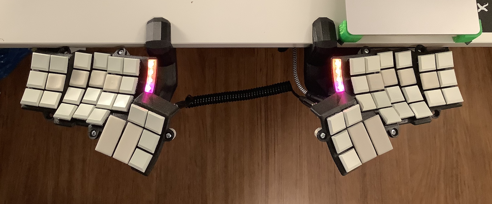
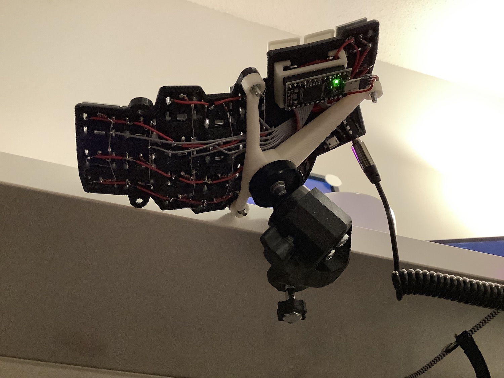
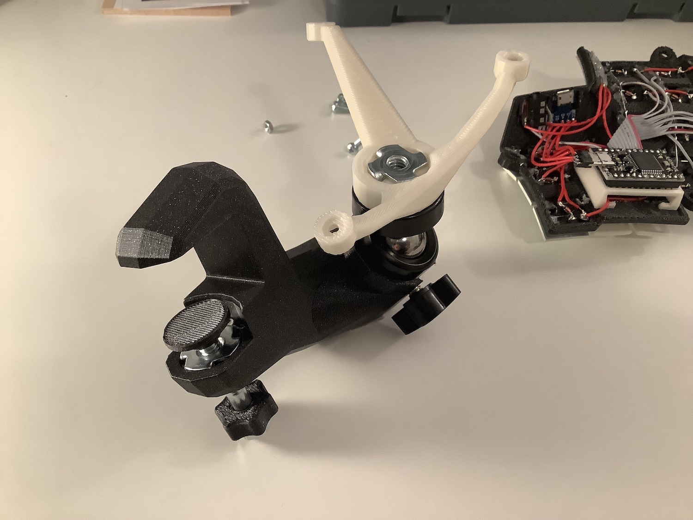
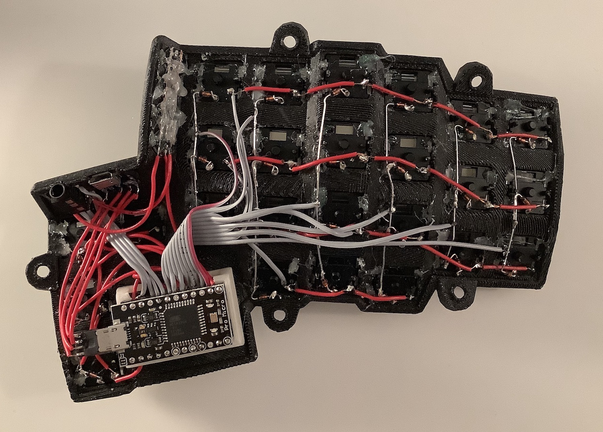

# Finished product

## Top view

This is my home computer setup as of 2020-05-18. A cheap IKEA sit/stand desk, my
newly completed desk-mounted dactyl keyboard, and an older Apple Magic Trackpad.

In this shot you can also see the LEDs running an animation I made to just cycle
through a narrow range of hues to avoid being too jarring. Eventually this will
signal notifications on the host computer but for now I have the lights turned
off.

Earlier in the design of the keyboard I considered another mount to keep the
trackpad at the same level as the keyboard but I'm really surprised at how
comfortable it is to use positioned just past the right hand keyboard. This is
great for me because despite having switched to a trackball mouse several months
earlier, nothing beats precision scrolling.

## Below

The wiring is pretty exposed. I prefer this simplicity to a lot of the keyboard
cases that add height without giving you any real benefits. It's a DIY keyboard
already and, in my opinion, a fully enclosed case doesn't make it look more
professional.

I did have some concerns about having this in an office setting where delicate
components are exposed to stray dogs but that's moot for the foreseeable future.

Anywho, one other nice benefit to mounting this off the front of the desk is the
ability to run the USB cable under my desk and out of sight.

## Mount

This is the assembled keyboard mount without the keyboard.

The main black print is the [table hook](../pre-rendered/table-hook.stl) and in the clamp part (left) is the [swivel plate](../pre-rendered/clamp-swivel-plate.stl)
(it doesn't really stay in place when not clamped) sitting on top of a 1/4" hex
bolt screwed into a tee-nut and the hex head covered by a small comfortable
[knob](../pre-rendered/clamp-knob.stl).

The other end holds an off-the-shelf ball mount, and on top of that in white is
the [bottom mount](../pre-rendered/bottom-mount.stl) to which the keyboard 
attaches with 3 sets of m3 screws and nuts.

## Wiring

Here's a rough look at the wiring for the left half.

All of the switches are hot-glued into the plate for extra security. As an added
bonus these glue sticks contain glitter.

The finger cluster wiring is pretty clean considering I removed the diodes from
an earlier version for re-use, but the thumb cluster is where all the action is
and it's hard to see what's going on there.

Right over the 2u thumb keys I have the [socket-mount](../pre-rendered/socket-mount.stl)
super-glued and the 24-pin IC socket sits inside. A couple of ribbon cables 
connect it to the finger cluster and TRRS breakout board, as well as another 8
individual wires for the thumb matrix and the LED chain. Lastly, a gutted micro
USB connector connects the micro USB breakout board to the mounted pro micro.

The pro micro has diode leg pins to hold it firmly into place in the IC socket,
and with all of the other wires the socket doesn't actually need glue to stay in
place.

The LED column (left of all the finger switches) is hard to make out underneath
all of the hot glue. This is partly to make sure they stay in place but also to
shield the bare copper wires used to connect all of the VCC and GND pads.
